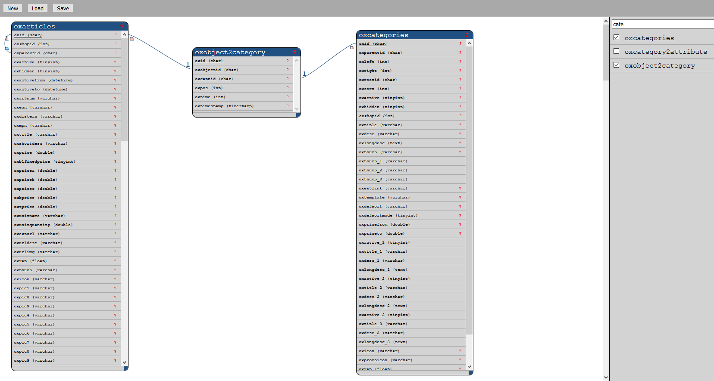

# Install

## Description

Visualize table relations. The system detect relations which store in the database. Also it contain the relations in a file (not finish till now) to help the system, display the correct relation between the tables.

Module was created for Oxid 6.x

## Install
1. Copy files into following directory
        
        source/modules/rs/dbschema
        
2. Add to composer.json at shop root
  
        "autoload": {
            "psr-4": {
                "rs\\dbschema\\": "./source/modules/rs/dbschema"
            }
        },

3. Refresh autoloader files with composer.

        composer dump-autoload
        
4. Enable module in the oxid admin area, Extensions => Modules